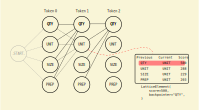

# Viterbi algorithm

## Introduction

A limitation of the basic implementation of the Averaged Perceptron model is that it is greedy when it's predicting the label for a token. This is because it predicts the label for each token in turn and selects the best label for that token. This is a limitation because once the model has predicted a label, it commits to that label. This might be optimal *locally* but might not be optimal *globally*, for the whole sentence.

The Viterbi algorithm is a way to address this limitation by choosing the sequence of labels that maximise the likelihood for the whole sentence, rather than each individual token.

This comes at a cost though. The Viterbi algorithm is a more complex algorithm to implement and the run time performance significantly slower.

## How it works with the Averaged Perceptron

> [!NOTE]
>
> This is not an general explanation of the Viterbi algorithm. Instead we focus on the specific implementation for this application.

### Algorithm outline

Rather than commit to a label for a given token as we process each token, we will instead consider all possible label transitions for each token, score them and keep track of those scores. Once we have done this across the whole sequence, we can backtrack through the scores for each token and select the path that maximises the overall score.

Therefore, the algorithm has three parts:

1. Initialise the *lattice*.
2. Iterate *forward* through the sequence to calculate scores and store them in the lattice.
3. Back track through the lattice and use the scores the select the best path.

The lattice is the data structure we will use to keep track of the scores during the forward path. In general terms, the lattice is a $n\times m$ matrix, where $n$ is the number of labels and $m$ is the number of tokens.

> insert diagram

The lattice is populated one column at a time. Each element of a column represents a possible current label for the given token. We want to calculate the score for each transition from the previous label to the current label, where the previous label can be any of the possible labels. The information we store at that element is the best score and the previous label that resulted in that score.



> **Why do we only keep the best score?**
>
> Once we've calculated all these scores and kept the best score of each (previous label, current label), we then back track through the lattice to pick the path with the maximum overall score.
>
> If a given lattice element is in that path, then the only way to maximise the global score is the use the best score for that element. Using any other score will necessarily result in a lower overall score.

Once the lattice has been populated, we can back track through it to find the best label sequence. We start with the label that has the highest score for the last element. We know what the previous label has to be to get that score, so that becomes the label before. We also know that to maximise the score for that label, we have to use the previous label we stored that resulted in that maximum score. And so on, and so on.

The result then the sequence of labels (in reverse) for the sentence that maximises the overall likelihood for that sentence.

### Implementation

#### 1. Initialise the lattice

We will define a `LatticeElement` dataclass to store the best score and backpointer to the label for the previous token that resulted in that score.

```python
@dataclass
class LatticeElement:
    """Dataclass for holding the score and backpointer for an element in the Viterbi
    lattice.

    Attributes
    ----------
    score : float
        The best score for the current label calculated from current label combined with
        all possible previous labels.
    backpointer : str
        The previous label that, when combined with the current label, yielded the best
        score.
    """

    score: float
    backpointer: str
```

We then initialise the lattice.

```python
# Define the lattice.
# For each element in the sequence of features, we define a dictionary. The dict
# keys are the possible labels for that item. The values are the LatticeElement
# dataclass which stores the best score for that label and a backpointer to the
# previous label that resulted in that score.
lattice = [
    defaultdict(lambda: LatticeElement(-float("inf"), ""))
    for _ in range(seq_len)
]
```

#### 2. Iterate forward through the sequence

The first column of the lattice has to handled specially. For all columns after this one, we can transition from any possible to label to any current label. However for the first column, we can only transition from the **-START-** label any current label.

```python
# Initialise for first feature set of features_seq
pos = self._get_pos_from_features(features_seq[0])
for current_label in labels:
    score = self._score(
        features_seq[0] | label_features("-START-", pos), current_label
    )
    # Select the best score, store it and set the backpointer to the
    # previous label that resulted in this score.
    if score > lattice[0][current_label].score:
        lattice[0][current_label].score = score
        lattice[0][current_label].backpointer = "-START-"
```

Here, the `label_features` function calculates the features that are based on the previous label, returning them as a set. We join this set with the set of features for the first token to calculate the score for each possible current label using the `_score` function.

```python
def _score(self, features: set[str], current_label: str) -> int:
    """Calculate score for current label given the features for the token at the
    current position and the given previous label.

    Parameters
    ----------
    features : set[str]
        Set of features for token at current position.
    current_label : str
        Label to calculate score for.

    Returns
    -------
    int
        Score
    """
    score = 0
    for feat in features:
        if feat not in self.weights:
            continue

        # Increment score by weight for current feature for current label
        score += self.weights[feat].get(current_label, 0)

    return score
```

This scoring function is effectively the same functionality from the `predict` function of the greedy Averaged Perceptron. 

We update the score and backpointer for the lattice at element 0 for the current label.

We then move on to the main forward iteration, which does the same thing except we now calculate the score for every (previous label, current label) pair.

```python
# Forward pass, starting at t=1 because we've already initialised t=0
for t, features in enumerate(features_seq[1:], 1):
    # Extract POS tag for current feature set.
    pos = self._get_pos_from_features(features)

    # Iterate over all combinations of previous and current labels for each
    # set of features.
    # Calculate the score for each label combination and store the best score
    # plus the backpointer to the previous label that yielded that score.
    for current_label, prev_label in product(labels, labels):
        score = lattice[t - 1][prev_label].score + self._score(
            features | label_features(prev_label, pos), current_label
        )
        # Select the best score, store it and set the backpointer to the
        # previous label that resulted in this score.
        if score > lattice[t][current_label].score:
            lattice[t][current_label].score = score
            lattice[t][current_label].backpointer = prev_label
```

Note that the score calculation here also include the score of previous label currently being considered. This is because we want to maximise the score for the *transition* from previous label to current label.

#### 3. Back track to find the label sequence

With a fully populated lattice, we can back track through to find the optimal sequence of labels.

The first step is to find the best label for the last element of the sequence.

```python
# Find the best label for the last element of the lattice, since there isn't a
# backpointer for this.
backpointer = self._argmax(labels, lattice[-1])
```

where `_argmax` just returns the label with the highest score.

Now we can iterate backwards through lattice following the backpointers.

```python
# Iterate backwards through the lattice.
# At each step, append the backpointer that yielded the best score to the label
# sequence. Note the the resultant label sequence will be in reverse.
for score_dict in reversed(lattice):
    label_seq.append(backpointer)
    # Update backpointer to point to the label that resulted in the best score for last backpointer
    backpointer = score_dict[backpointer].backpointer
```

This gives us the optimal label sequence (but in reverse).

## Model training

The way we train the model has to be adjusted slightly to be compatible with the Viterbi algorithm. In the greedy Averaged Perceptron, we predicted each token in turn and could update the weights immediately after each prediction as necessary. When using the Viterbi algorithm, we have to predict a whole sequence in one go, then update the weights for each incorrect token in the sequence.

The weight update stage is also slightly different. We want to do two things:

1. Decrement the weights for the features for the incorrect predicted label.
2. Increment the weights for the features for the correct label.

Importantly, unlike the greedy Averaged Perceptron weight updates, the sets of features for these two case might not be the exactly same because the features for a given token include features based on the previous label.

The weight update looks like this

```python
def update(
    self,
    truth: str,
    guess: str,
    predicted_features: set[str],
    truth_features: set[str],
) -> None:
    """Update weights for given features.

    This only makes changes if the true and predicted labels are different.

    Parameters
    ----------
    truth : str
        True label for given features.
    guess : str
        Predicted label for given features.
    predicted_features : set[str]
        Features for predicted sequence.
    truth_features : set[str]
        Features for true (correct) sequence.
        """
	if truth == guess:
        return None

    # Update feature weights because truth != guess.
    # We decrement the features for the predicted label by -1 and increment the
    # features for the true label by one. If the same feature appears in both
    # feature sets, the net change is 0.
    # We do the weights updates this way because (unlike the greedy Averaged
    # Perceptron) the weights for the true sequence and different to the weights for
    # the (incorrect) predicted sequence - although only for the features related to
    # the previous label.
    for feat in predicted_features:
        # Get weights dict for current feature, or empty dict if new feature
        weights = self.weights.setdefault(feat, {})
        # Update weights for feature:
        # Decrement weight for predicted label by -1.
        self._update_feature(guess, feat, weights.get(guess, 0.0), -1.0)

    for feat in truth_features:
        # Get weights dict for current feature, or empty dict if new feature
        weights = self.weights.setdefault(feat, {})
        # Update weights for feature:
        # Increment weight for correct label by +1
        self._update_feature(truth, feat, weights.get(truth, 0.0), 1.0)
```

`predicted_features` are the features that were used by the Viterbi algorithm and resulted in the incorrect predicted label.

`truth_features` are the features from the true sequence for the token that was incorrectly labelled. Importantly, `truth_features` contains the features based on the *true* previous label.

## Performance comparison

Comparison of the greedy and Viterbi Averaged Perceptron models, using the same hyperparameters.

| Model   | Word accuracy | Sentence accuracy | Model size | Time    |
| ------- | ------------- | ----------------- | ---------- | ------- |
| Greedy  | 97.57%        | 93.18%            | 0.96 MB    | 0:08.20 |
| Viterbi | 97.67%        | 94.08%            | 1.04 MB    | 1:35:57 |

Using the Viterbi algorithm does yield a notable improvement to sentence accuracy, but it comes at a significant increase in training time (12x longer).
